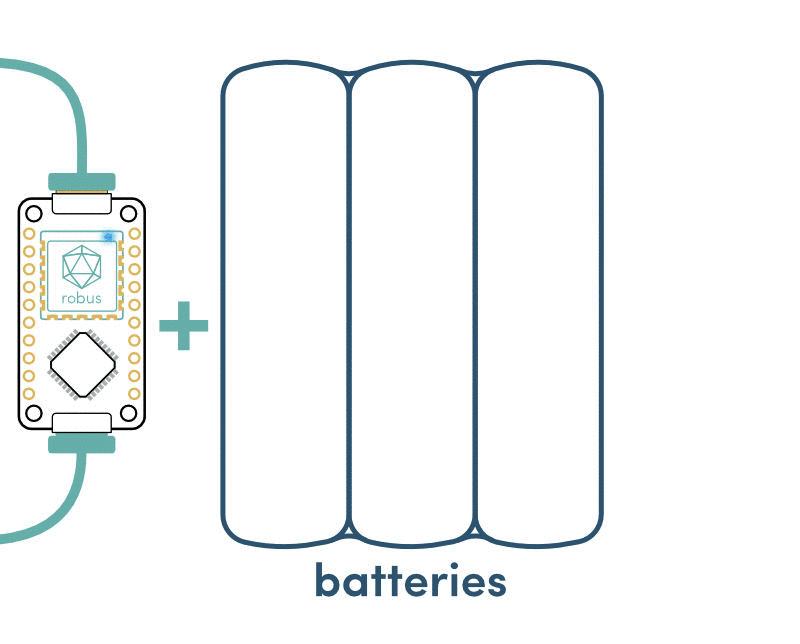

# Robus: the Robust Robotic Bus

Robus is a ligthweight & low-cost yet powerful modular network made to **unify communications between components in hardware products**. It runs on low-cost microcontrollers with one UART interface.

Robus is especially useful for robotics applications as robots require to orchestrate simultaneously a wide diversity of components (sensors, actuators, batteries,... ) with high performance constraints on reactivity and reliability.

## Robus key features

- Module detection: robus detects when a new component is added or removed from the network 
- Automatic addressing: robus automatically assigns a new address to a new node
- Topology: robus creates a tree struture matching with the physical topology of the network
- Reliability: robus is fully written in [Rust](https://www.rust-lang.org/fr-FR/) 
- Robustness: the standard version use differential communication to ensure proper data transmission even in noisy environments.
- Performance: the communication speed already goes up to 2 megabauds
- Multicast: robus allows for communication among multiple modules with one message
- Collision detection: robus detects and corrects errors when two modules are trying to communicate at the same time.

## How Robus works ?

Robus introduces an innovative *(patent pending)* bus involving both a point-to-point (PTP) and a serial bus. 
- The PTP bus is used for detecting physical connection between nodes
- The serial bus is used for the transmission of all messages between nodes. 

To be robus compatible, each node needs to run on a microcontroller with UART interface and a RS485 driver. The RS485 driver is used for differential communication on the serial bus. Lighter implementations are possible.

A board with Robus can detect and communicate with any other boards on the netowrk. To drive each components on a board (e.g. motor control, sensor acquisition, ...), we strongly encourge the use of [Luos](https://github.com/pollen-robotics/luos) that is designed to work seamlessly with Robus on the same µC. 

### Recommended Hardware implementation

Robus is currently developped on a Arm Cortex M0 from ST and the standard implementation of the robus bus involves a differential RS845 serial bus (2 wire) and a digital PTP (1 wire).

It is possible to implement alternative one depending on your needs, no differential serial bus, differential PTP, multiple serial bus. Do not hesitate to contact us if you are interested.

### Development boards

You can start testing/using Robus by using one of those [development board](https://www.luos.io/products/):

- [32F072BDISCOVERY](https://www.luos.io/product/stm32f0-disco/)
- [Luos L0 (available soon)](https://www.luos.io/product/luos-l0/)
- [NUCLEO-F072RB](https://www.luos.io/product/nucleo-f0/)

## License

The Robus network technology is patented yet licensed under the LGPLv3 License (See [LICENSE-LGPLv3](LICENSE) for details). Therefore feel free to use it as your own convenience for your project, and share your improvements!

For any enquiry about alternative usage of Robus technology that is not included under this licence (e.g. C, VHDL, double licencing, ...), please [contact us](mailto:contact@pollen-robotics.com).

